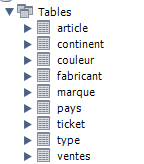

## Docker

Si vous avez déjà vu Docker, créez via docker un conteneur MySQL et importez le fichier `beer.sql` dans votre conteneur.

Si vous n'avez pas encore vu Docker, importez le fichier `beer.sql` dans votre base de données MySQL ou demandez à votre
formateur de vous aider ou de vous donner le docker-compose.

### Prérequis

- Vous devez avoir un dockerfile et un docker-compose.yml
- Vous ne devez pas utiliser de `bind mount` !
- Vous avez le droit d'utiliser un `volume`

## Etude du modèle

### Effectuez un reverse engineering du modèle

- Quelles sont les tables ?
- 

### Il y a des mauvaises pratiques dans ce modèle, lesquelles ?

La table vente est au pluriel, les autres au singulier. 
Année dans les ventes limitée à 11 caractères


## Exercices

Réalisez les requêtes suivantes :

### Quels sont les tickets qui comportent l’article d’ID 500, afficher le numéro de ticket uniquement ?

```mysql
SELECT NUMERO_TICKET FROM ventes WHERE ID_ARTICLE = 500;
```

### Afficher les tickets du 15/01/2014.

```mysql
SELECT ANNEE, NUMERO_TICKET FROM ticket where DATE_VENTE = "2014-01-15";
```

### Afficher les tickets émis du 15/01/2014 et le 17/01/2014.

```mysql
SELECT NUMERO_TICKET FROM ticket where DATE_VENTE between "2014-01-15" and "2014-01-17";
```

### Editer la liste des articles apparaissant à 50 et plus exemplaires sur un ticket.

```mysql
SELECT NUMERO_TICKET, NOM_ARTICLE, QUANTITE FROM ventes v JOIN article a ON v.ID_ARTICLE = a.ID_ARTICLE WHERE QUANTITE >= 50 ORDER BY QUANTITE DESC;
```

### Quelles sont les tickets émis au mois de mars 2014.

```mysql
SELECT NUMERO_TICKET, DATE_VENTE FROM ticket WHERE MONTH(DATE_VENTE) = 3 and year(DATE_VENTE) = 2014;
```

### Quelles sont les tickets émis entre les mois de mars et avril 2014 ?

```mysql
SELECT NUMERO_TICKET, DATE_VENTE FROM ticket WHERE YEAR(DATE_VENTE) = 2014 and MONTH(DATE_VENTE) BETWEEN 3 and  4;
```

### Quelles sont les tickets émis au mois de mars et juin 2014 ?

```mysql
SELECT NUMERO_TICKET, DATE_VENTE FROM ticket WHERE YEAR(DATE_VENTE) = 2014 and MONTH(DATE_VENTE) IN ('3', '6');
```

### Afficher la liste des bières classée par couleur. (Afficher l’id et le nom)

```mysql
SELECT ID_ARTICLE, NOM_ARTICLE, NOM_COULEUR from article a JOIN couleur c ON a.ID_Couleur = c.ID_Couleur ORDER BY c.ID_Couleur DESC;
```

### Afficher la liste des bières n’ayant pas de couleur. (Afficher l’id et le nom)

```mysql
SELECT NOM_ARTICLE, ID_Couleur FROM article WHERE ID_Couleur IS NULL;
```